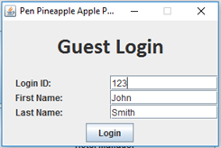
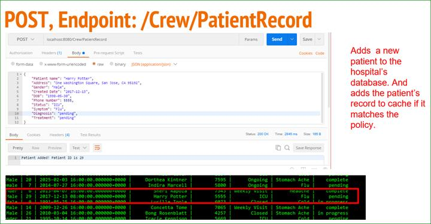

<html>

<head>
	
	<title>Project Profolio</title>
	
</head>

<h1 id ="tableContents">Steven Yen's Project Compilation</h1>
	Steven Yen 
	MSCS Student 
	San Jose State University 
	stevenyen510@gmail.com 
	  

<a href = "#H2Proj">Hydrogen Production System (ME BS Senior Project)</a> 
<a href = "#PVProj">Photovoltaic System Energy Data Analysis Tools (Chevron Energy Solutions))</a> 
<a href = "#MazeProj">Random maze generator and solver</a> 
<a href = "#Calendar">Graphical Calendar/Scheduler</a> 
<a href = "#Hotel">Hotel Reservation System</a> 
<a href = "#Connect4">Connect 4 Game AI</a> 
<a href = "#TwitterArchive">Twitter Archive Web App</a> 
<a href = "#integrationTest">Integration Testing for Web Apps</a> 
<a href = "#DDoSsim">DDoS Attack Simulation and Defense</a> 
<a href = "#HospitalApp">Hospital Patient Record Keeping Application</a> 

<h1 id="H2Proj">Hydrogen Production System (ME BS Senior Project)</h1>
	<ul>
		<li>Parts selection (DC Motor)</li>
		<li>Create 3D Designs for the Different Components</li>
		<li>Created components from 3D drawings in machine shop</li>
		<li>Bench testing</li>
	</ul>

 

<a href = "#tableContents">Back to Top</a> 
<h1 id="PVProj">Photovoltaic System Energy Data Analysis Tools (Chevron Energy Solutions)</h1>
<ul>
<li>Created Excel tools using VBA and Macros for data analysis, reduction, and visualization</li>
<li>Determine correlation between solar photovoltaic system energy
production and weather data</li>
<li>Used correlation to infer system energy production from weather
data</li>
<ul>

 

 &nbsp;</h1>

<h1>&nbsp;</h1>

 

&nbsp;

 
<a href = "#tableContents">Back to Top</a> 
<h1 id="MazeProj">Random maze generator and solver</h1>
<a href = "https://github.com/stevenyen510/random-maze-solver">Project Link</a> 

·&nbsp;&nbsp;&nbsp;&nbsp;&nbsp;&nbsp;&nbsp;&nbsp;
Generates random maze using disjoint sets. 

a.&nbsp;&nbsp;&nbsp;&nbsp;&nbsp;&nbsp; Start
out with N = nxn isolated rooms. Represented by an Nx4 array of arrays, where
each length 4 array corresponds to the room’s 4 wall (0 for no wall, 1 for
wall).

b.&nbsp;&nbsp;&nbsp;&nbsp;&nbsp; Randomly
pick a room and randomly pick a wall to remove. Removing a wall corresponds to the
union operation joining two rooms. Continue this until the starting room and
the goal room is in the same set. This means there’s a path from start to goal.

c.&nbsp;&nbsp;&nbsp;&nbsp;&nbsp;&nbsp; Randomly
solve this maze using BFS and print path.

d.&nbsp;&nbsp;&nbsp;&nbsp;&nbsp; Randomly
solve this maze using DFS and print path.

&nbsp;

&nbsp;

&nbsp;

&nbsp;

&nbsp;

&nbsp;

 

&nbsp;

<a href = "#tableContents">Back to Top</a> 
<h1 id="Calendar">Graphical Calendar/Scheduler</h1>
<a href = "https://github.com/stevenyen510/Graphical-Calendar">Project Link</a> 

&nbsp;

Created using Java Swing and AWT libraries

Follows Model View Controller (MVC) Design Pattern

 

 

&nbsp;

<a href = "#tableContents">Back to Top</a> 
<h1 id="Hotel">Hotel Reservation System</h1>
<a href = "https://github.com/damonluu/Hotel-Reservation-System">Project Link</a> 

1.&nbsp;&nbsp;&nbsp;&nbsp;&nbsp;&nbsp; Reservation
System for a hotel

2.&nbsp;&nbsp;&nbsp;&nbsp;&nbsp;&nbsp; Manages
two types of accounts (Hotel Manager vs Guest)

3.&nbsp;&nbsp;&nbsp;&nbsp;&nbsp;&nbsp; Allows
Guests to make reservation or view/cancel existing reservation

4.&nbsp;&nbsp;&nbsp;&nbsp;&nbsp;&nbsp; Allows
Managers to select dates from a graphical calendar to view reservations on that
date

5.&nbsp;&nbsp;&nbsp;&nbsp;&nbsp;&nbsp; Manager
can Save Data which serializes the data structure used to store reservations

6.&nbsp;&nbsp;&nbsp;&nbsp;&nbsp;&nbsp; Manager
can Load previous data from the serialized file

&nbsp;

1. UML Sequence Diagram for making a reservation

&nbsp;

&nbsp;

 

&nbsp;

<a href = "#tableContents">Back to Top</a> 
<h1 id="Connect4">Connect 4 Game AI</h1>
<a href = "https://github.com/stevenyen510/CS156Project">Project Link</a> 

1.&nbsp;&nbsp;&nbsp;&nbsp;&nbsp;&nbsp; Created
command line interface for administering the game

2.&nbsp;&nbsp;&nbsp;&nbsp;&nbsp;&nbsp; Player
can play against an AI

3.&nbsp;&nbsp;&nbsp;&nbsp;&nbsp;&nbsp; Uses
Minimax Algorithm to evaluate moves

4.&nbsp;&nbsp;&nbsp;&nbsp;&nbsp;&nbsp; Tested
out different heuristic functions 

a.&nbsp;&nbsp;&nbsp;&nbsp;&nbsp;&nbsp; Tallying
all 69 possible 4-in-row's in the board

b.&nbsp;&nbsp;&nbsp;&nbsp;&nbsp; Based
on “threats”

c.&nbsp;&nbsp;&nbsp;&nbsp;&nbsp;&nbsp; Decision-Tree
Classifier (sciKit Learn)  

 

&nbsp;

<a href = "#tableContents">Back to Top</a> 
<h1 id="TwitterArchive">Twitter Archive Web App</h1>

·&nbsp;&nbsp;&nbsp;&nbsp;&nbsp;&nbsp;&nbsp;&nbsp;
Allow user to search an archive of saved tweets

·&nbsp;&nbsp;&nbsp;&nbsp;&nbsp;&nbsp;&nbsp;&nbsp;
Built using Node.JS with Express.JS

·&nbsp;&nbsp;&nbsp;&nbsp;&nbsp;&nbsp;&nbsp;&nbsp;
Backend has REST API POST/GET endpoints that returns JSON objects

·&nbsp;&nbsp;&nbsp;&nbsp;&nbsp;&nbsp;&nbsp;&nbsp;
Frontend buttons and forms that triggers POST/GET requests to the
backend, parses the response JSON, and display the results appropriately

 
 

 

&nbsp;

<a href = "#tableContents">Back to Top</a> 
<h1 id="integrationTest">Integration Testing for Web Apps </h1>

·&nbsp;&nbsp;&nbsp;&nbsp;&nbsp;&nbsp;&nbsp;&nbsp;
Use Selenium Framework to simulate user actions on a web UI (such
as filling out text boxes, clicking button, selecting from dropdown, etc.) for
test cases with over 30 steps.

·&nbsp;&nbsp;&nbsp;&nbsp;&nbsp;&nbsp;&nbsp;&nbsp;
Followed Selenium best practices and Page Object Model/Pattern to
ecapsulate each page or view of the web app with their associated actions.

·&nbsp;&nbsp;&nbsp;&nbsp;&nbsp;&nbsp;&nbsp;&nbsp;
Created utilities to save screenshot of UI when tests fails.

·&nbsp;&nbsp;&nbsp;&nbsp;&nbsp;&nbsp;&nbsp;&nbsp;
Integrated other engineer’s library to log information in CSV
output files.

·&nbsp;&nbsp;&nbsp;&nbsp;&nbsp;&nbsp;&nbsp;&nbsp;
Programmatically sent HTTP Request to backend rest endpoints and
parsing response JSON to assert state.

&nbsp;

&nbsp;

&nbsp;

&nbsp;

<a href = "#tableContents">Back to Top</a> 
<h1 id="DDoSsim">DDoS Attack Simulation and Defense</h1>

·&nbsp;&nbsp;&nbsp;&nbsp;&nbsp;&nbsp;&nbsp;&nbsp;
Simulate distributed denial of service attack

·&nbsp;&nbsp;&nbsp;&nbsp;&nbsp;&nbsp;&nbsp;&nbsp;
Wrote Node.JS applications that listens for signal from master
and launches GET Flood Attack (or slowhttptest)

·&nbsp;&nbsp;&nbsp;&nbsp;&nbsp;&nbsp;&nbsp;&nbsp;
Set up open source Intrusion Prevention System (IPS) Snort to
block attack

·&nbsp;&nbsp;&nbsp;&nbsp;&nbsp;&nbsp;&nbsp;&nbsp;
Created virtual network of 6 machines in VirtualBox and simulated
attack

&nbsp;

<table cellpadding=0 cellspacing=0 align=left>
 <tr>
  <td width=26 height=11></td>
 </tr>
 <tr>
  <td></td>
  <td></td>
 </tr>
</table>

 &nbsp;

 

&nbsp;

 
<a href = "#tableContents">Back to Top</a> 
<h1 id="HospitalApp">Hospital Patient Record Keeping Application</h1>
<a href = "https://github.com/anusha-vij-6062/CS249-DistributedSystems">Project Link</a> 

·&nbsp;&nbsp;&nbsp;&nbsp;&nbsp;&nbsp;&nbsp;&nbsp;
Built backend using Java Servlet hosted on Jetty Container

·&nbsp;&nbsp;&nbsp;&nbsp;&nbsp;&nbsp;&nbsp;&nbsp;
Serves GET/PUT/POST/DELETE requests and triggers corresponding
actions in the database

·&nbsp;&nbsp;&nbsp;&nbsp;&nbsp;&nbsp;&nbsp;&nbsp;
Stores results of frequent query using Memcache to improve
retrieval speed

&nbsp;

<a href = "#tableContents">Back to Top</a> 

</body>

</html>

